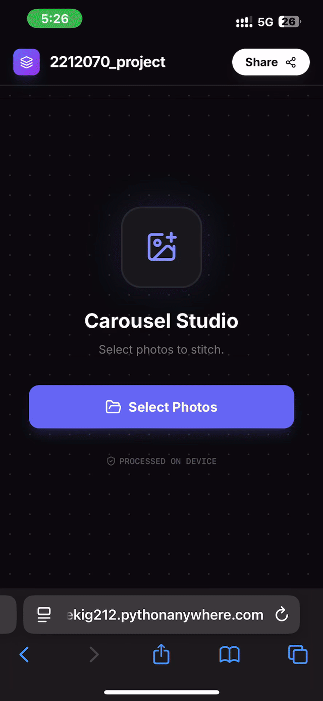

<p align="center">
  
</p>

# 🚀 Carousel Studio  
**Live Demo:** https://fekig212.pythonanywhere.com/

**Carousel Studio** is a local-first, privacy-focused web application designed to create seamless Instagram swipeable panoramas. It allows users to stitch multiple images together, edit them, reorder them, and automatically slice them into perfectly sized 4:5 portrait slides (1080x1350) for Instagram.

## 🚀 Features

* **Seamless Stitching:** Automatically joins multiple photos into one continuous canvas.
* **Smart Slicing:** Automatically cuts the stitched panorama into 1080x1350 (4:5 aspect ratio) segments optimized for Instagram Portrait mode.
* **Privacy First:** All image processing happens **client-side** in the browser. No images are ever uploaded to a server.
* **Interactive Workspace:**
    * **Drag & Drop:** Reorder images easily using a sortable interface.
    * **Image Editing:** Built-in cropping and rotation tools (powered by `Cropper.js`).
    * **Zoom Controls:** Adjust the workspace view.
* **Format Support:**
    * Supports JPG, PNG.
    * **HEIC Support:** Automatically converts Apple's HEIC format to JPG using `heic2any`.
* **Cross-Platform Export:**
    * **Desktop:** Downloads slices as a `.zip` file.
    * **Mobile (iOS/Android):** Uses the native Web Share API to share directly to Instagram or save to Photos.
* **Responsive UI:** Modern Dark Mode interface built with Tailwind CSS.

## 🛠️ Tech Stack

* **Frontend:** HTML5, JavaScript (Vanilla), Tailwind CSS (via CDN).
* **Backend:** Python (Flask) - *Used primarily for serving the application locally.*
* **Key Libraries:**
    * `Cropper.js`: For image manipulation.
    * `Sortable.js`: For drag-and-drop reordering.
    * `JSZip` & `FileSaver.js`: For zipping and downloading files.
    * `heic2any`: For iOS image compatibility.
    * `Lucide`: For iconography.

## 📋 Prerequisites

To run this project locally, you need:

1.  **Python 3.x** installed on your system.
2.  **Flask** library.

## 📦 Installation & Usage

1.  **Clone or Download** this repository.
2.  Ensure the file structure is as follows:
    ```text
    /project-folder
    ├── flask_app.py
    └── index.html
    ```
3.  **Install Flask** (if you haven't already):
    ```bash
    pip install flask
    ```
4.  **Run the Application:**
    Open your terminal/command prompt in the project folder and run:
    ```bash
    python flask_app.py
    ```
5.  **Access the App:**
    Open your web browser and navigate to:
    `http://127.0.0.1:5000` or `http://localhost:5000`

## 🎮 How to Use

1.  **Upload:** Click the "Select Photos" button or drag and drop images onto the drop zone.
2.  **Arrange:** Drag the slides left or right to change their order.
3.  **Edit:** Click/Tap on any specific image to open the crop/rotate editor.
4.  **Preview:** Use the zoom slider at the top to inspect the seamless transitions.
5.  **Export:** Click the **Share/Download** button in the top right.
    * On Desktop, this will download a `carousel_images.zip`.
    * On Mobile, this will open the native sharing menu.

## 📂 Project Structure

* **`flask_app.py`**: A minimal Flask server configuration. It serves `index.html` from the root directory (`template_folder='.'`).
* **`index.html`**: The core application. Contains all structural HTML, styling (Tailwind config), and logical JavaScript for canvas manipulation and state management.

## ⚠️ Note on Offline Usage

While the application logic is "local-only" (meaning it doesn't send data to a cloud server), the `index.html` file currently fetches libraries (Tailwind, Cropper, etc.) via **CDNs** (Content Delivery Networks). An internet connection is required to load the page initially. Once loaded, image processing is done offline.

---
